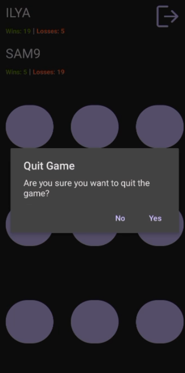

# Android TicTacToe Game
This is an Android application that implements the classic TicTacToe game, where two players take turns marking cells in a 3x3 grid. The app also includes features such as user scores, game updates, and the ability to quit the game.

# Features
Play TicTacToe against another player on the same device.
Keep track of user scores (wins and losses).
Real-time game updates.
Quit the game at any time

# Prerequisites
- Android device or emulator with API level 24 or higher.

# Server

This app requires a backend server to manage game and updates. You can find the server code and
setup instructions in the GameServer2 repository.

# Technologies Used

- Android SDK
- Java
- Android Architecture Components (MVVM)

# Functional Description

## Opening screen

When user open the app, he should see the loading page.
While the user on that page, two things will happen:

1. A request will be sent to Firebase to get the app configurations. If the request fail, defaults
   will be used.
2. The app will check if user credentials (username and password) are stored, if yes will try to
   login. If the login succeed, user will see the Games screen, otherwise the user will see login
   form.
   

## Login screen

The user will see the login page if no user credentials stored in the Shared Preferences.
After successful login with valid username and password and that exists in the DB, the user will be
redirected to the Games screen. The credentials will be stored in the device for future use. if the
user, do not have the user, by clicking on "No user?" will navigate to the Register page.

## Register screen

The user can sign up in the Register page, the credentials will be stored in the DB and in Shared
Preferences. If the user already have an account, he can navigate to the login screen by clicking
on "Already have a user?".

## Games screen

In this screen, the user will see a list of games he can join and play. By pressing Logout button,
the user can go back to the Login scree. The user will see his username and score on that page. The
user can refresh this page by swipe move, this will update the games list. The user can also create
a new game by pressing the "+" icon.

## Game screen

The user will get to that screen by creating a new game or joining a existing one on the Games
screen. When creating a new game the user will wait until the second player will join the game. All
that time, the game will be presented in the Games screen so others can join, and the screen of the
game will be disabled. The game will start only when there are two players. A player can leave the
game at any time. A game with no players will be deleted from the server.
Each player will make a move in his turn, only during the turn the board will be enabled. While a
player is in the game, the app will poll for updates about the game: Update the board with new moves
of the players, update the status and score when the game ends (win/lose/draw/player left).
The polling will stop once the game finished or the user exited the app. The polling will continue,
when the user will open the app again.
When a game ends, each player will be notified about that and the results will be updated in the DB.
After, confirming the message about the ending of the game, the user will move to the Games page and
the game will be deleted from the server after all players will leave.

### Waiting for second user

### Game start

### Waiting opponents move

### Win or lose notification

### Leave game

### Other player left

# Technical Description

## Technologies

* Android - The user login and play using the application.
* Java Spring - The server use that framework
* JPA - Maps the DB tables to objects.
* TOMCAT
* Rest API - Client server communication
* PostgresSQL - Contain the tables
* Firebase - Used to monitor the application and store and manage settings remotely.

## ERD

## System diagram

## Screen tree

## Sequence diagram

## Requests

### Signup

A POST request with username and password in the body. If user exist, status 400 will return. On
successful signup, the user will be added to the DB and status 200 will return.

### Login request

A GET request user name and password are arguments. For successful login the status is 200, if user
does not exist, status 400 will return.

### Get score

A GET request will return the score of the user given as argument.

### Create game

A POST request. The arguments are the username that issued the request and details of the requested
game to create (currently there is only one type of game).
This request will create a new game and set the creator as the first player. The response will
contain the game_id, game type and the username of the creator.

### Get joinable games

A GET request will return a list of games the user can join.
A user can join only to games where only one player and the status of the game is WAITING_TO_START.

### Join game

ChangeGame is a Patch request used to make a change in a game like join or leave.

### Leave game

